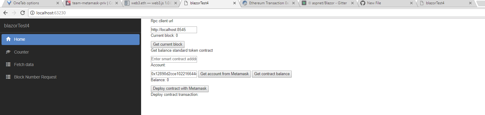

# Nethereum-Blazor-Wasm

This repo is for testing the Experimental .Net WASM (Web Assembly) / blazor compatibility with Nethereum (and Metamask integration)

So far has succesfully integrated to Ethereum using Nethereum and Metamask. There has been some issues loading Accounts from private keys, but this won't be necessary if using Metamask to manage your accounts and sign transactions on the web.

## So what is blazor?

Blazor and Web Assembly allows you to run .Net applications in the browser. 

Mono has been compiled to web assembly and the run time can load .Net assemblies in the same way as in a server / desktop enviroment. 

To enable faster loads the Nethereum dlls could be (will be) compiled AOT in the future and distributed as such.

Blazor it is based on Razor (Asp.Net template engine) and has the vision to provide a much better and simpler way to create SPAs. Any Asp.net developer should be able to create an SPA easily.

## Get started with Blazor

To get started, please check out these resources in order. (Don't just jump like me straight to the github repo :))

**For the best and greatest introduction on Blazor first read** Steve Sanderson's blog  http://blog.stevensanderson.com/2018/02/06/blazor-intro/

To learn about specific topics a new website has just been created: https://learn-blazor.com/

And of course the Blazor github repository: https://github.com/aspnet/Blazor.

## In a simpler way this means, .Net Dapps on the Web!



## Simple introduction, and work with Nethereum, Metamask.

### Installation blazor .Net project template

You can either download this repo and update the nugets or get the latest template and add Nethereum.Web3 package to the Client Project.

To install the latest template just run:

```
dotnet new -i  Microsoft.AspNetCore.Blazor.Templates::0.1.* --nuget-source https://dotnet.myget.org/F/blazor-dev/api/v3/index.json
```

### The code:

In a similar way to any other Razor page, we need to declare first the using statements, these include the Nethereum, Blazor and also the custom Blazor HttpClient which will be used for our Rpc calls to an Ethereum public node.

```csharp
@using Nethereum.Web3;
@using Nethereum.JsonRpc.Client;
@using Nethereum.Web3.Accounts;
@using Microsoft.AspNetCore.Blazor.Browser.Interop;
@using Nethereum.Contracts;

@inject HttpClient Http
```

#### The Razor part (View template)

Blazor provides already the capability to bind our controls, (including 2 way binding) and event handling like (@onclick) of a button.

This simple example, demonstrates the 2 way binding of the url we will use to connect to Ethereum.

```html
<p>Rpc client url</p>
<input @bind(rpcUrl) type="text" placeholder="Enter rpc url" />
```

This is the rest of the blazor / razor view:

```html
<p>Current block: @currentBlock</p>
<button @onclick(GetCurrentBlock)>Get current block</button>

<p>Get balance standard token contract</p>
<input @bind(smartContractAddress) type="text" placeholder="Enter smart contract adddress..." />

<p>Account:</p>
<input @bind(userAddress) type="text" placeholder="Enter address..." />
<button @onclick(GetAccountFromMetamask)>Get account from Metamask</button>
<button @onclick(GetBalance)>Get contract balance</button>
<p>Balance: @balance</p>

<button @onclick(DeployContract)>Deploy contract with Metamask</button>
<p>Deploy contract transaction: @deployContractTransaction</p>

```

#### The functional code

All the functionality of code it is included on the @functions in this sample (this could be structure better with a ViewModel in the future).

```csharp
@functions {

    string rpcUrl;
    string userAddress;
    string smartContractAddress;
    int currentBlock = 0;
    string deployContractTransaction = "";
    string accountAddress = "";
    decimal balance;
    string abiStandardToken = @"[{""constant"":false,""inputs"":[{""name"":""_spender"",""type"":""address""},{""name"":""_value"",""type"":""uint256""}],""name"":""approve"",""outputs"":[{""name"":""success"",""type"":""bool""}],""type"":""function""},{""constant"":true,""inputs"":[],""name"":""totalSupply"",""outputs"":[{""name"":""supply"",""type"":""uint256""}],""type"":""function""},{""constant"":false,""inputs"":[{""name"":""_from"",""type"":""address""},{""name"":""_to"",""type"":""address""},{""name"":""_value"",""type"":""uint256""}],""name"":""transferFrom"",""outputs"":[{""name"":""success"",""type"":""bool""}],""type"":""function""},{""constant"":true,""inputs"":[{""name"":""_owner"",""type"":""address""}],""name"":""balanceOf"",""outputs"":[{""name"":""balance"",""type"":""uint256""}],""type"":""function""},{""constant"":false,""inputs"":[{""name"":""_to"",""type"":""address""},{""name"":""_value"",""type"":""uint256""}],""name"":""transfer"",""outputs"":[{""name"":""success"",""type"":""bool""}],""type"":""function""},{""constant"":true,""inputs"":[{""name"":""_owner"",""type"":""address""},{""name"":""_spender"",""type"":""address""}],""name"":""allowance"",""outputs"":[{""name"":""remaining"",""type"":""uint256""}],""type"":""function""},{""inputs"":[{""name"":""_initialAmount"",""type"":""uint256""}],""type"":""constructor""},{""anonymous"":false,""inputs"":[{""indexed"":true,""name"":""_from"",""type"":""address""},{""indexed"":true,""name"":""_to"",""type"":""address""},{""indexed"":false,""name"":""_value"",""type"":""uint256""}],""name"":""Transfer"",""type"":""event""},{""anonymous"":false,""inputs"":[{""indexed"":true,""name"":""_owner"",""type"":""address""},{""indexed"":true,""name"":""_spender"",""type"":""address""},{""indexed"":false,""name"":""_value"",""type"":""uint256""}],""name"":""Approval"",""type"":""event""}]";


    protected override void OnInit()
    {
        rpcUrl = "http://localhost:8545";
        userAddress = "0x12890d2cce102216644c59daE5baed380d84830c";
    }

```
##### Interacting with the blockchain and retrieving the state from smart contracts 

To get the balance from the standard token smart contract or to make a simple call like the current block number, first we declare Web3 using the new SimpleRpcClient which accepts the Blazor HttpClient.

All the other code is the standard Nethereum functionality. One thing to notice the call for StateHasChanged, this is to update the async changes, which won't be required in the future.

```csharp
    async void GetBalance()
    {
        var web3 = new Web3(new SimpleRpcClient(new Uri(rpcUrl), Http, null));
        var contract = web3.Eth.GetContract(abiStandardToken, smartContractAddress);
        var balanceFunction = contract.GetFunction("balanceOf");
        var balanceWei = await balanceFunction.CallAsync<System.Numerics.BigInteger>(userAddress);
        balance = Web3.Convert.FromWei(balanceWei);
        StateHasChanged();
    }

    async void GetCurrentBlock()
    {
        var web3 = new Web3(new SimpleRpcClient(new Uri(rpcUrl), Http, null));
        var block = await web3.Eth.Blocks.GetBlockNumber.SendRequestAsync();
        currentBlock = (int)block.Value;
        StateHasChanged();
    }
```

##### Interacting with metamask to sign the transactions

To deploy a contract or get the current account interacting with metamask, we interop with Javascript. This is similar to how we interop with Unity3d when using WebGL. https://medium.com/@juanfranblanco/nethereum-2-0-0-rc5-unity3d-integration-eb7664664813

Blazor improves on the intereoperability that Unity3d provides, as there is no need as a developer convert the data from .Net to Javascript and viceversa.

Calling a Javascript function, like "sendTransaction" or "getAccount" becomes as simple as:

```csharp

RegisteredFunction.Invoke<object>("sendTransaction", null, data);

userAddress = RegisteredFunction.Invoke<string>("getAccount");
````

Here is the full code to Deploy an Smart contract and to get the current account from Metamask.

```csharp
    async void DeployContract()
    {
        var contractByteCode = "0x60606040526040516020806106f5833981016040528080519060200190919050505b80600160005060003373ffffffffffffffffffffffffffffffffffffffff16815260200190815260200160002060005081905550806000600050819055505b506106868061006f6000396000f360606040523615610074576000357c010000000000000000000000000000000000000000000000000000000090048063095ea7b31461008157806318160ddd146100b657806323b872dd146100d957806370a0823114610117578063a9059cbb14610143578063dd62ed3e1461017857610074565b61007f5b610002565b565b005b6100a060048080359060200190919080359060200190919050506101ad565b6040518082815260200191505060405180910390f35b6100c36004805050610674565b6040518082815260200191505060405180910390f35b6101016004808035906020019091908035906020019091908035906020019091905050610281565b6040518082815260200191505060405180910390f35b61012d600480803590602001909190505061048d565b6040518082815260200191505060405180910390f35b61016260048080359060200190919080359060200190919050506104cb565b6040518082815260200191505060405180910390f35b610197600480803590602001909190803590602001909190505061060b565b6040518082815260200191505060405180910390f35b600081600260005060003373ffffffffffffffffffffffffffffffffffffffff16815260200190815260200160002060005060008573ffffffffffffffffffffffffffffffffffffffff168152602001908152602001600020600050819055508273ffffffffffffffffffffffffffffffffffffffff163373ffffffffffffffffffffffffffffffffffffffff167f8c5be1e5ebec7d5bd14f71427d1e84f3dd0314c0f7b2291e5b200ac8c7c3b925846040518082815260200191505060405180910390a36001905061027b565b92915050565b600081600160005060008673ffffffffffffffffffffffffffffffffffffffff168152602001908152602001600020600050541015801561031b575081600260005060008673ffffffffffffffffffffffffffffffffffffffff16815260200190815260200160002060005060003373ffffffffffffffffffffffffffffffffffffffff1681526020019081526020016000206000505410155b80156103275750600082115b1561047c5781600160005060008573ffffffffffffffffffffffffffffffffffffffff1681526020019081526020016000206000828282505401925050819055508273ffffffffffffffffffffffffffffffffffffffff168473ffffffffffffffffffffffffffffffffffffffff167fddf252ad1be2c89b69c2b068fc378daa952ba7f163c4a11628f55a4df523b3ef846040518082815260200191505060405180910390a381600160005060008673ffffffffffffffffffffffffffffffffffffffff16815260200190815260200160002060008282825054039250508190555081600260005060008673ffffffffffffffffffffffffffffffffffffffff16815260200190815260200160002060005060003373ffffffffffffffffffffffffffffffffffffffff1681526020019081526020016000206000828282505403925050819055506001905061048656610485565b60009050610486565b5b9392505050565b6000600160005060008373ffffffffffffffffffffffffffffffffffffffff1681526020019081526020016000206000505490506104c6565b919050565b600081600160005060003373ffffffffffffffffffffffffffffffffffffffff168152602001908152602001600020600050541015801561050c5750600082115b156105fb5781600160005060003373ffffffffffffffffffffffffffffffffffffffff16815260200190815260200160002060008282825054039250508190555081600160005060008573ffffffffffffffffffffffffffffffffffffffff1681526020019081526020016000206000828282505401925050819055508273ffffffffffffffffffffffffffffffffffffffff163373ffffffffffffffffffffffffffffffffffffffff167fddf252ad1be2c89b69c2b068fc378daa952ba7f163c4a11628f55a4df523b3ef846040518082815260200191505060405180910390a36001905061060556610604565b60009050610605565b5b92915050565b6000600260005060008473ffffffffffffffffffffffffffffffffffffffff16815260200190815260200160002060005060008373ffffffffffffffffffffffffffffffffffffffff16815260200190815260200160002060005054905061066e565b92915050565b60006000600050549050610683565b9056";
   
        System.Numerics.BigInteger totalSupply = System.Numerics.BigInteger.Parse("1000000000000000000");
        var builder = new DeployContractTransactionBuilder();
        var data = builder.GetData(contractByteCode, abiStandardToken, totalSupply);
        RegisteredFunction.Invoke<object>("sendTransaction", null, data);
    }

    void GetAccountFromMetamask()
    {
        userAddress = RegisteredFunction.Invoke<string>("getAccount");
    }
```

### The Javascript interop side

Metamask integration is the same as in any other Dapp. Only difference is that to interact from our .Net code with Javascript the function calls need to be registered. Note that there is also the possibility to interop from Javascript to .Net too, not provided in this sample.

```javascript
  Blazor.registerFunction('sendTransaction', sendTransaction);
  Blazor.registerFunction('getAccount', getAccount);
```

The full script on our index file includes the standard Metamask installation checks, and afterwards the two functions registered to interop, "sendTransaction" and "getAccounts".

```javascript
window.addEventListener('load', function() {
        // Checking if Web3 has been injected by the browser (Mist/MetaMask)
        if (typeof web3 !== 'undefined') {
                window.web3 = new Web3(web3.currentProvider);
                if (typeof (window.web3.eth.accounts[0]) == 'undefined') {
                        alert('Please unlock Metamask to submit transactions');
                } else {
                    Blazor.registerFunction('sendTransaction', sendTransaction);
                    Blazor.registerFunction('getAccount', getAccount);
                 }
        } else {
            alert('Please install Metamask to submit transactions');
        }
        });

        function getAccount() {
            return web3.eth.accounts[0];
        }

        function sendTransaction(to, data) {
            
            var from = web3.eth.accounts[0];
            if ((typeof (to) !== 'undefined') && (to !== null)) {
                web3.eth.sendTransaction({ from: from, to: to, data: data }, function (error, hash) {
                    if (error) {
                        console.log(error);
                    }
                    else {
                        console.log(hash);
                    }
                });
            } else {
                web3.eth.sendTransaction({ from: from, data: data }, function (error, hash) {
                    if (error) {
                        console.log(error);
                    }
                    else {
                        console.log(hash);
                    }
                });
            }
         }
```
